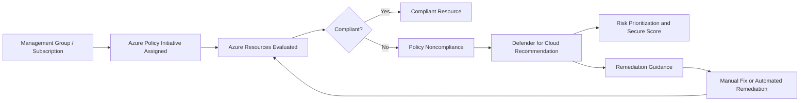
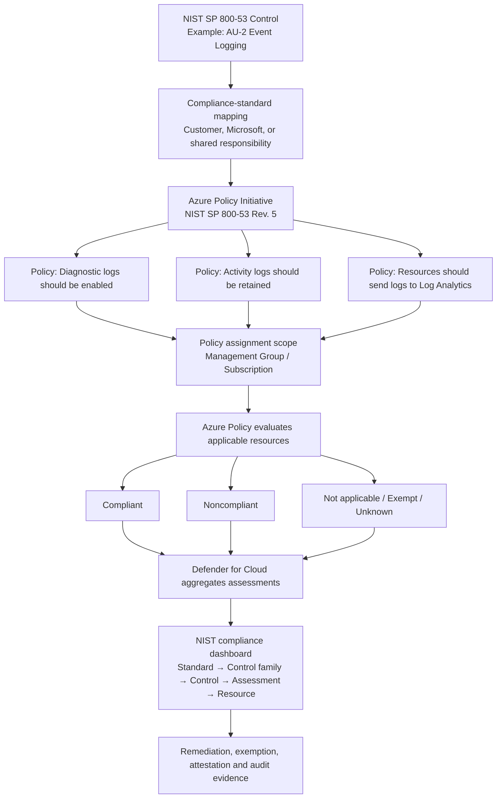

# Azure-Policies

**Azure Policy provides the governance and enforcement engine; Microsoft Defender for Cloud uses policy results and security assessments to identify, prioritize, and help remediate security risks.**

## How they work together



### 1. Azure Policy defines the required security state

Azure Policy contains rules describing how resources should be configured. Examples include:

* Storage accounts must disable public access.
* Key Vaults must enable soft delete and purge protection.
* SQL databases must enable auditing.
* Resources must send diagnostic logs to Log Analytics.
* Private endpoints must be used.
* Certain resource types or locations are not allowed.

Multiple policy definitions can be grouped into an **initiative**, such as the Microsoft Cloud Security Benchmark or a regulatory compliance framework. Azure Policy then evaluates resources at the management-group, subscription, resource-group, or resource level. ([Microsoft Learn][1])

### 2. Defender for Cloud consumes the security assessment results

Defender for Cloud continuously assesses resources against assigned security standards and policies. When a resource does not satisfy a control, Defender for Cloud generates a security recommendation explaining:

* What is wrong
* Which resources are affected
* The security risk
* How to remediate it
* How the recommendation affects secure score
* Whether remediation can be automated

Recommendations are generated from continuous assessments against security policies and compliance standards. ([Microsoft Learn][2])

### 3. Policy handles enforcement; Defender handles security context

The distinction is important:

| Azure Policy                                | Defender for Cloud                                           |
| ------------------------------------------- | ------------------------------------------------------------ |
| Evaluates resource configuration            | Interprets findings from a security-risk perspective         |
| Audits or enforces requirements             | Prioritizes security recommendations                         |
| Can deny deployments                        | Provides remediation guidance                                |
| Can deploy required settings                | Calculates secure score                                      |
| Can modify resource properties              | Shows attack paths and security posture                      |
| Manages initiatives and assignments         | Tracks security standards and regulatory compliance          |
| Primarily preventive and governance-focused | Preventive, posture-management and threat-protection focused |

For example, an Azure Policy can prevent creation of a storage account with public blob access. Defender for Cloud can identify existing storage accounts with public exposure, prioritize them based on risk, and recommend corrective action.

## Common Azure Policy effects used with Defender

### `Audit`

Allows the resource to exist but marks it noncompliant.

Example:

```text
Storage accounts should restrict network access
```

Defender for Cloud can surface the failed assessment as a recommendation.

### `Deny`

Blocks a deployment or configuration that violates the policy.

Example:

```text
Do not allow storage accounts with public network access enabled
```

This prevents new security debt from being introduced.

### `DeployIfNotExists`

Deploys a required configuration when it is missing.

Examples:

* Deploy diagnostic settings
* Install monitoring agents
* Configure Microsoft Defender settings
* Send logs to a central Log Analytics workspace

This normally requires a managed identity on the policy assignment and the correct RBAC permissions.

### `Modify`

Adds or changes supported properties during resource creation or update.

Examples:

* Add required tags
* Adjust allowed configuration properties
* Enforce selected resource settings

### `Disabled`

Keeps the policy definition in an initiative but turns off its evaluation for the assignment.

## Practical example: Key Vault

Suppose your organization assigns a Key Vault security initiative.

The initiative might contain policies requiring:

* Public network access disabled
* Private endpoint configured
* Purge protection enabled
* Diagnostic logs enabled
* RBAC authorization enabled
* Firewall rules configured

Azure Policy evaluates every Key Vault.

A noncompliant vault appears in Azure Policy as a failed resource. Defender for Cloud may then display recommendations such as:

```text
Azure Key Vaults should disable public network access
```

or:

```text
Diagnostic settings should be enabled on Key Vaults
```

The security team can use Defender for Cloud to understand the risk and priority. The platform or governance team can use Azure Policy remediation tasks, Terraform, Bicep, PowerShell, or Azure CLI to correct the configuration.

## Regulatory compliance

Regulatory standards in Defender for Cloud are commonly implemented through Azure Policy initiatives. Defender evaluates resources against the initiative controls and presents the results in its Regulatory Compliance dashboard. ([Microsoft Learn][3])

For example:

```text
NIST control
   ↓
Azure Policy initiative control
   ↓
Individual policy assessments
   ↓
Compliant and noncompliant resources
   ↓
Defender for Cloud compliance dashboard
```

This gives leadership and auditors a control-level view, while Azure Policy provides the underlying resource-level evaluation.

## Recommended enterprise operating model

A practical deployment pattern is:

1. Assign security initiatives at the management-group level.
2. Start restrictive policies in `Audit` mode.
3. Review Defender for Cloud recommendations and false positives.
4. Create exemptions for approved exceptions with an owner, justification, and expiration date.
5. Remediate existing resources.
6. Change high-confidence preventive controls from `Audit` to `Deny`.
7. Use `DeployIfNotExists` for repeatable configurations such as diagnostics.
8. Track progress through secure score, recommendations, policy compliance, and regulatory compliance.

## Important limitation

Not every Defender for Cloud recommendation is necessarily backed by a traditional Azure Policy definition. Defender for Cloud also uses native security assessments, cloud security posture-management capabilities, vulnerability information, threat intelligence, and workload-specific signals. Azure Policy is therefore a major foundation of Defender for Cloud posture management, but it is not the only assessment mechanism. ([Microsoft Learn][4])

The simplest way to remember the relationship is:

> **Azure Policy defines and enforces the rules. Defender for Cloud turns assessment results into prioritized security posture, compliance, and remediation actions.**

[1]: https://learn.microsoft.com/en-us/azure/governance/policy/overview?utm_source=chatgpt.com "Overview of Azure Policy"
[2]: https://learn.microsoft.com/en-us/azure/defender-for-cloud/security-recommendations?utm_source=chatgpt.com "Security Recommendations - Defender for Cloud"
[3]: https://learn.microsoft.com/en-us/azure/defender-for-cloud/assign-regulatory-compliance-standards?utm_source=chatgpt.com "Assign regulatory compliance standards in ..."
[4]: https://learn.microsoft.com/en-us/azure/defender-for-cloud/concept-cloud-security-posture-management?utm_source=chatgpt.com "What is Cloud Security Posture Management (CSPM)"


## Expanded compliance flow



The important point is that a **NIST control is not normally enforced directly**. It is a governance requirement that Microsoft maps to one or more technical Azure assessments.

# 1. NIST control

A NIST control describes the security outcome that an organization must achieve.

For example:

> **AU-2 — Event Logging**

At a high level, the organization must determine which events should be logged, ensure that appropriate systems generate those logs, and periodically review the logging requirements.

NIST defines the required security outcome, but it does not prescribe one specific Azure configuration such as a particular Log Analytics workspace or diagnostic-setting name.

A NIST control may include:

* A base control
* Control enhancements
* Organizationally defined parameters
* Required policies and procedures
* Technical and nontechnical implementation responsibilities
* Evidence that an auditor may request

Microsoft’s NIST regulatory initiative maps NIST compliance domains and controls to Azure Policy definitions that can assess relevant Azure configurations. One NIST control may be associated with several Azure Policy definitions because a broad compliance outcome often requires multiple technical configurations. ([Microsoft Learn][1])

## Example

A logging-related NIST control could require evidence that:

* Azure resources generate security logs.
* Subscription activity is recorded.
* Logs are centrally collected.
* Log retention is configured.
* Access to logs is restricted.
* Monitoring alerts are established.
* Log-review procedures exist.

Azure Policy can test some of these technical conditions. It cannot fully test whether employees follow the organization’s incident-review procedure or whether management formally approved the logging standard.

# 2. Azure Policy initiative control

Microsoft packages the regulatory mapping into an **Azure Policy initiative**, also called a **policy set definition**.

An initiative groups multiple policy definitions so the collection can be assigned and managed as one unit. ([Microsoft Learn][2])

For NIST SP 800-53 Rev. 5, the hierarchy is conceptually:

```text
NIST SP 800-53 Rev. 5 initiative
│
├── Access Control
│   ├── AC-2 Account Management
│   ├── AC-3 Access Enforcement
│   └── AC-6 Least Privilege
│
├── Audit and Accountability
│   ├── AU-2 Event Logging
│   ├── AU-6 Audit Record Review
│   └── AU-12 Audit Record Generation
│
└── System and Communications Protection
    ├── SC-7 Boundary Protection
    ├── SC-8 Transmission Confidentiality
    └── SC-28 Protection of Information at Rest
```

Under each control, Azure associates one or more technical assessments.

For example:

```text
NIST AU-2 Event Logging
│
├── Diagnostic settings should be enabled on Key Vaults
├── Diagnostic settings should be enabled on Storage accounts
├── Diagnostic settings should be enabled on SQL servers
└── Activity logs should be retained for the required period
```

The exact mappings depend on the version of the Microsoft-built initiative and the resource types available in the environment. Microsoft publishes the mappings between the NIST controls and the policy definitions contained in the initiative. ([Microsoft Learn][1])

## Assignment scope

The initiative definition does nothing until it is **assigned**.

An assignment determines which resources are evaluated. Typical scopes are:

```text
Tenant Root Management Group
└── Corporate Management Group
    ├── Production Management Group
    │   ├── Subscription A
    │   └── Subscription B
    └── Nonproduction Management Group
        ├── Subscription C
        └── Subscription D
```

Assigning the initiative at a management-group level allows its controls to apply to inherited subscriptions and resource groups, subject to exclusions and exemptions. A policy assignment defines the scope of resources evaluated by the policy or initiative. ([Microsoft Learn][3])

## Parameters

Policy parameters customize how the initiative behaves in your environment. For example:

```text
Required Log Analytics workspace:
  /subscriptions/.../resourceGroups/rg-monitoring/providers/
  Microsoft.OperationalInsights/workspaces/law-central-prod

Allowed locations:
  eastus2
  centralus

Minimum retention:
  365 days

Policy effect:
  AuditIfNotExists
```

Therefore, the NIST initiative provides the framework mapping, while your initiative assignment provides the environment-specific implementation choices.

# 3. Individual policy assessments

Each policy definition evaluates a specific technical condition.

For example, the following control statement is too broad for direct machine evaluation:

```text
The organization must generate audit records for defined events.
```

Azure translates portions of that requirement into testable questions:

```text
Does this Key Vault have the required diagnostic setting?

Does this storage account send the required log categories to
the approved Log Analytics workspace?

Is the subscription Activity Log retained for the required duration?

Does this SQL server have auditing enabled?
```

Each policy definition normally contains:

* An `if` condition identifying applicable resources
* A `then` section specifying the policy effect
* Parameters that allow assignment-level customization
* Metadata connecting the policy to the regulatory control
* Logic that determines compliance

## Example policy logic

A simplified diagnostic-setting policy might behave like this:

```json
{
  "if": {
    "field": "type",
    "equals": "Microsoft.KeyVault/vaults"
  },
  "then": {
    "effect": "AuditIfNotExists",
    "details": {
      "type": "Microsoft.Insights/diagnosticSettings"
    }
  }
}
```

This means:

1. Find every Key Vault in the assignment scope.
2. Check whether the required diagnostic-setting resource exists.
3. Mark the Key Vault noncompliant when the required configuration is missing.

The actual built-in definition usually contains more detailed logic, parameters, existence conditions and supported log categories.

## Common effects

| Effect              | Role in compliance                                                |
| ------------------- | ----------------------------------------------------------------- |
| `Audit`             | Identifies a disallowed or incorrect property without blocking it |
| `AuditIfNotExists`  | Identifies a missing related configuration                        |
| `Deny`              | Prevents a noncompliant deployment or update                      |
| `DeployIfNotExists` | Can deploy a missing configuration through remediation            |
| `Modify`            | Can add or change supported resource properties                   |
| `Disabled`          | Stops evaluation for that policy reference                        |

For `DeployIfNotExists` and `Modify`, existing noncompliant resources generally require a remediation task. Azure Policy provides remediation workflows for these effects. ([Microsoft Learn][4])

# 4. Compliant and noncompliant resources

Azure Policy evaluates each **applicable resource** against each relevant policy.

The result is resource-level compliance evidence.

## Compliant example

```text
Resource:
  /subscriptions/sub-a/resourceGroups/rg-payments-prod/
  providers/Microsoft.KeyVault/vaults/kv-payments-prod

Assessment:
  Key Vault diagnostic settings should be enabled

Result:
  Compliant

Evidence:
  Diagnostic setting exists
  Required categories are enabled
  Destination is the approved Log Analytics workspace
```

## Noncompliant example

```text
Resource:
  /subscriptions/sub-a/resourceGroups/rg-payments-prod/
  providers/Microsoft.KeyVault/vaults/kv-legacy-prod

Assessment:
  Key Vault diagnostic settings should be enabled

Result:
  Noncompliant

Reason:
  No matching diagnostic setting was found
```

## Other states and considerations

Not every resource appears simply as compliant or noncompliant.

A resource or assessment may also be affected by:

* **Not applicable:** The policy condition does not apply to the resource type or configuration.
* **Exemption:** The resource or scope has an approved policy exemption.
* **Conflicting:** Multiple assignments produce conflicting results.
* **Unknown or not started:** Evaluation has not completed or data is unavailable.
* **Protected through another mechanism:** A control might require manual evidence rather than a technical policy assessment.

Azure Policy compliance data is generated by periodic and event-driven evaluations. It can also be retrieved or refreshed through compliance-data mechanisms, but the overall experience should not be treated as an instantaneous, transaction-level reporting system. ([Microsoft Learn][5])

## Roll-up behavior

Suppose AU-2 has four technical assessments:

| Assessment             | Applicable resources | Compliant | Noncompliant |
| ---------------------- | -------------------: | --------: | -----------: |
| Key Vault diagnostics  |                   20 |        18 |            2 |
| Storage diagnostics    |                   50 |        45 |            5 |
| SQL auditing           |                   10 |        10 |            0 |
| Activity Log retention |      4 subscriptions |         3 |            1 |

The control may appear unhealthy because one or more underlying assessments have noncompliant resources.

```text
AU-2 Event Logging
├── 76 compliant evaluations
└── 8 noncompliant evaluations
```

The dashboard roll-up does not mean that the organization has satisfied every procedural and organizational element of AU-2. It shows the status of the technical and manual assessments represented in that compliance standard.

# 5. Defender for Cloud compliance dashboard

Defender for Cloud consumes and presents compliance assessments through a framework-oriented view.

Instead of forcing a security officer to navigate hundreds of individual policy definitions, the dashboard presents the information as:

```text
Compliance standard
   ↓
Control family or domain
   ↓
NIST control
   ↓
Azure assessment
   ↓
Affected resource
```

Microsoft currently separates the experiences so that the Azure portal is used to configure and assign compliance standards, while the Defender portal focuses on monitoring and tracking assigned standards. ([Microsoft Learn][6])

## Dashboard navigation example

```text
NIST SP 800-53 Rev. 5
└── Audit and Accountability
    └── AU-2 Event Logging
        ├── Key Vault diagnostic settings should be enabled
        │   ├── kv-payments-prod       Healthy
        │   └── kv-legacy-prod         Unhealthy
        │
        ├── Storage account diagnostic settings should be enabled
        │   ├── stpaymentsprod         Healthy
        │   └── stlegacyprod           Unhealthy
        │
        └── SQL auditing should be enabled
            └── sql-payments-prod      Healthy
```

For each assessment, security teams can typically investigate:

* The affected subscriptions
* The resource type
* The individual resource IDs
* The assessment status
* The remediation recommendation
* The related NIST control
* The responsibility owner
* Available exemptions or attestations

Defender for Cloud evaluates resources and workloads against assigned security policies and regulatory frameworks and surfaces recommendations for identified security issues. ([Microsoft Learn][7])

# Responsibility ownership

The regulatory initiative also identifies who is responsible for a control:

| Responsibility               | Meaning                                                            |
| ---------------------------- | ------------------------------------------------------------------ |
| **Customer**                 | Your organization must implement and maintain the control          |
| **Microsoft**                | Microsoft implements the control for the underlying Azure platform |
| **Shared**                   | Microsoft and the customer each implement different parts          |
| **Manual or organizational** | Evidence must be supplied outside an automated resource assessment |

Azure Policy regulatory-compliance initiatives organize controls based on customer, Microsoft and shared responsibility. For Microsoft-owned controls, Microsoft can provide implementation and third-party attestation information rather than evaluating one of your resources. ([Microsoft Learn][8])

## Shared-responsibility example

Consider physical protection of Azure datacenters:

```text
Microsoft responsibility:
  Physical datacenter security
  Facility access controls
  Hardware disposal procedures

Customer responsibility:
  Azure resource access controls
  Subscription RBAC
  Application authentication
  Customer-managed encryption settings
```

Azure Policy does not inspect Microsoft’s datacenter doors. That portion is supported through Microsoft audit and compliance documentation. It can, however, evaluate configurations under the customer’s control.

# End-to-end example

Consider an organization that needs to demonstrate compliance with a NIST logging control.

## Step 1: Assign the NIST initiative

```text
Assignment:
  NIST SP 800-53 Rev. 5

Scope:
  /providers/Microsoft.Management/managementGroups/production

Parameters:
  Central workspace = law-security-prod
  Retention = 365 days
```

## Step 2: Azure evaluates resources

Azure Policy discovers:

```text
25 Key Vaults
80 Storage accounts
15 SQL servers
6 subscriptions
```

It evaluates each applicable resource against the relevant logging policies.

## Step 3: Results are generated

```text
Key Vaults:
  22 compliant
   3 noncompliant

Storage accounts:
  70 compliant
  10 noncompliant

SQL servers:
  14 compliant
   1 noncompliant

Subscription Activity Logs:
   5 compliant
   1 noncompliant
```

## Step 4: Defender rolls the results into the NIST control

```text
NIST SP 800-53 Rev. 5
└── AU-2 Event Logging
    └── Status: Unhealthy
```

The control is unhealthy because underlying technical assessments have failed.

## Step 5: Security reviews the findings

The security team uses Defender for Cloud to determine:

```text
Which NIST control is affected?
Which assessments failed?
Which subscriptions contain the failures?
Which resources are exposed?
Which issues should be corrected first?
```

## Step 6: Platform team remediates

The platform team can:

* Create an Azure Policy remediation task.
* Deploy the diagnostic settings using Terraform or Bicep.
* Correct the resources manually.
* Change the policy from `AuditIfNotExists` to `DeployIfNotExists`.
* Apply `Deny` to prevent new noncompliant configurations where appropriate.
* Create a time-limited exemption for a justified exception.

## Step 7: Azure reevaluates

After remediation:

```text
Azure Policy reevaluates the resources
   ↓
Resources become compliant
   ↓
Underlying assessment becomes healthy
   ↓
NIST control status improves
   ↓
Defender dashboard reflects the updated state
```

# What the dashboard does—and does not—prove

A healthy Defender for Cloud NIST dashboard means that the represented automated and manual assessments are currently satisfied for the assessed scope.

It does **not**, by itself, prove full organizational NIST compliance or provide certification.

For example, Azure Policy can determine that diagnostic settings exist, but it may not prove that:

* The organization reviews the logs according to procedure.
* Incident-response personnel are properly trained.
* The logging standard was formally approved.
* Evidence is retained according to the organization’s legal obligations.
* Every organizationally defined NIST parameter has been addressed.
* Compensating controls have been tested and accepted.

The complete compliance package normally combines:

```text
Azure Policy assessment results
+ Defender for Cloud reports
+ Policy exemptions
+ Manual attestations
+ Microsoft compliance evidence
+ Organizational policies and procedures
+ Architecture documents
+ Operational records
+ Auditor validation
```

## Simplified interpretation

```text
NIST says:
“What security outcome must be achieved?”

Azure Policy initiative says:
“Which Azure checks help measure that outcome?”

Individual policies say:
“What exact technical configuration will be evaluated?”

Resource assessments say:
“Which specific resources passed or failed?”

Defender for Cloud says:
“What is our compliance posture, where are the gaps,
and what should we remediate?”
```

[1]: https://learn.microsoft.com/en-us/azure/governance/policy/samples/nist-sp-800-53-r5?utm_source=chatgpt.com "Regulatory Compliance details for NIST SP 800-53 Rev. 5"
[2]: https://learn.microsoft.com/en-us/azure/governance/policy/concepts/initiative-definition-structure?utm_source=chatgpt.com "Azure Policy initiative definition structure"
[3]: https://learn.microsoft.com/en-us/azure/governance/policy/concepts/assignment-structure?utm_source=chatgpt.com "Details of the policy assignment structure - Azure"
[4]: https://learn.microsoft.com/en-us/azure/governance/policy/how-to/remediate-resources?utm_source=chatgpt.com "Remediate non-compliant resources - Azure Policy"
[5]: https://learn.microsoft.com/en-us/azure/governance/policy/how-to/get-compliance-data?utm_source=chatgpt.com "Get compliance data of Azure resources"
[6]: https://learn.microsoft.com/en-us/azure/defender-for-cloud/concept-regulatory-compliance-standards?utm_source=chatgpt.com "Regulatory compliance in Defender for Cloud"
[7]: https://learn.microsoft.com/en-us/azure/defender-for-cloud/review-security-recommendations?utm_source=chatgpt.com "Review Security Recommendations"
[8]: https://learn.microsoft.com/en-us/azure/governance/policy/concepts/regulatory-compliance?utm_source=chatgpt.com "Regulatory Compliance in initiative definitions - Azure Policy"
